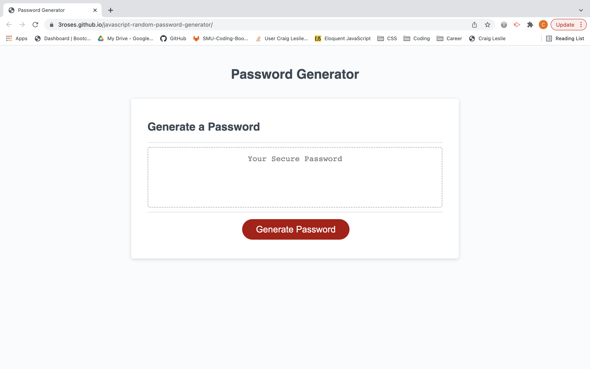

# javascript-random-password-generator

In this assignment, I created a function that generates a random password. First I established my global variables. Then I created another variable inside the writePassword function that determines the length of the password. This variable is determined by the user in a window.prompt and must be 8-128 characters long.
Once all this information is gathered, the generatePassword function generates a random password with the newly populated array of chosen characters.
A for loop runs, creating a random number which is used to grab a character out of the selectedChar array. The random number is used as an index value, to select a character at random from the array. These characters are cocatenated into a variable called randomChar. The randomChar variable is populated with one character each time the for loop runs. Once the for loop ends, the randomChar variable is populated with an array of characters that will become the random password. The items in this array are then concatenated with the var finalResult, which displays in the password box.

## Screenshot

## Webpage

[Here is a link to my final page](https://3roses.github.io/javascript-random-password-generator/)

